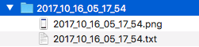

# Sharelog

Sharelog is an Android library to help sharing logs during app's runtime.
After calling the action, Sharelog will take a screenshot of the app, collect logs, prepare archive and call default Android's share action. After that, you will be able to choose the app to share the archive.

Sharelog in action
------------------


Example unzipped archive



Example logs file
```
10-16 04:03:23.666  2820  2820 I art     : Late-enabling -Xcheck:jni
10-16 04:03:23.666  2820  2820 W art     : Unexpected CPU variant for X86 using defaults: x86
10-16 04:03:23.907  2820  2820 W System  : ClassLoader referenced unknown path: /data/app/pl.dawidfiruzek.sharelogsample-2/lib/x86
10-16 04:03:24.106  2820  2820 W art     : Before Android 4.1, method android.graphics.PorterDuffColorFilter android.support.graphics.drawable.VectorDrawableCompat.updateTintFilter(android.graphics.PorterDuffColorFilter, android.content.res.ColorStateList, android.graphics.PorterDuff$Mode) would have incorrectly overridden the package-private method in android.graphics.drawable.Drawable
10-16 04:03:24.239  2820  2820 D Sharelog: onCreate
10-16 04:03:24.242  2820  2820 I Sharelog: onStart
10-16 04:03:24.249  2820  2820 E Sharelog: onResume
10-16 04:03:24.311  2820  2820 D         : HostConnection::get() New Host Connection established 0xe272b100, tid 2820
10-16 04:03:24.582  2820  2835 D libEGL  : Emulator has host GPU support, qemu.gles is set to 1.
10-16 04:03:24.601  2820  2835 E libEGL  : load_driver(/system/lib/egl/libGLES_emulation.so): dlopen failed: library "/system/lib/egl/libGLES_emulation.so" not found
10-16 04:03:24.621  2820  2835 D libEGL  : loaded /system/lib/egl/libEGL_emulation.so
10-16 04:03:24.622  2820  2835 D libEGL  : loaded /system/lib/egl/libGLESv1_CM_emulation.so
10-16 04:03:24.640  2820  2835 D libEGL  : loaded /system/lib/egl/libGLESv2_emulation.so
10-16 04:03:24.707  2820  2835 D         : HostConnection::get() New Host Connection established 0xf3493330, tid 2835
10-16 04:03:24.742  2820  2820 V Sharelog: onCreateOptionsMenu
10-16 04:03:24.923  2820  2835 I OpenGLRenderer: Initialized EGL, version 1.4
10-16 04:03:24.923  2820  2835 D OpenGLRenderer: Swap behavior 1
10-16 04:03:25.502  2820  2820 I Choreographer: Skipped 44 frames!  The application may be doing too much work on its main thread.
10-16 05:07:30.152  2820  2827 I art     : Ignoring second debugger -- accepting and dropping
10-16 05:07:30.293  2820  2827 I art     : Debugger is no longer active
10-16 05:07:30.293  2820  2827 I art     : Starting a blocking GC Instrumentation

```
Usage
-----
Add gradle dependency to your project
```
compile 'pl.dawidfiruzek:sharelog:1.0'
```
To init Sharelog, just call `Sharelog.getInstance(activity)` method with your activity as a parameter. After that, Sharelog will be automatically set to manual mode, which require to manually call `sharelog.capture()` method in your code.
Example:
```Kotlin
override fun onCreate(savedInstanceState: Bundle?) {
    super.onCreate(savedInstanceState)
    setContentView(R.layout.activity_main)
    sharelog = Sharelog.getInstance(this)
}

override fun onOptionsItemSelected(item: MenuItem): Boolean = when (item.itemId) {
    R.id.action_share_logs -> {
        sharelog.capture()
        true
    }
    else -> super.onOptionsItemSelected(item)
}
```

---

There is also a option to set Sharelog to gesture mode, which will automatically capture logs after detecting one of predefined gestures (triple, quad or quint taps). To use Sharelog in this mode, during initialization, explicitly set gesture mode. After that, you have to set `onTouchListener` and pass `motionEvent` to Sharelog.
Example:
```Kotlin
override fun onCreate(savedInstanceState: Bundle?) {
    super.onCreate(savedInstanceState)
    setContentView(R.layout.activity_main)
    sharelog = Sharelog.getInstance(this)
            .setGestureMode(SharelogGestureMode.TRIPLE_TAP)

    val root = findViewById<ConstraintLayout>(R.id.main_root)
    root.setOnTouchListener { _, motionEvent ->
        sharelog.capture(motionEvent)
        true
    }
}
```


License
-------

    Copyright 2017 Dawid Firuzek

    Licensed under the Apache License, Version 2.0 (the "License");
    you may not use this file except in compliance with the License.
    You may obtain a copy of the License at

      http://www.apache.org/licenses/LICENSE-2.0

    Unless required by applicable law or agreed to in writing, software
    distributed under the License is distributed on an "AS IS" BASIS,
    WITHOUT WARRANTIES OR CONDITIONS OF ANY KIND, either express or implied.
    See the License for the specific language governing permissions and
    limitations under the License.
