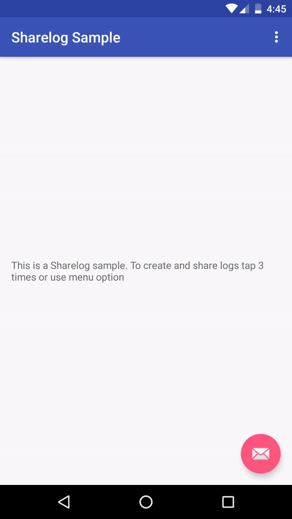

# Sharelog

Sharelog is an Android library to help sharing logs during app's runtime.
After calling the action, Sharelog will take a screenshot of the app, collect logs, prepare archive and call default Android's share action. After that, you will be able to choose the app to share the archive.

Sharelog in action
------------------



Usage
-----
Add gradle dependency to your project
```
compile 'pl.dawidfiruzek:sharelog:1.0'
```
To init Sharelog, just call `Sharelog.getInstance(activity)` method with your activity as a parameter. After that, Sharelog will be automatically set to manual mode, which require to manually call `sharelog.capture()` method in your code.
Example:
```Kotlin
override fun onCreate(savedInstanceState: Bundle?) {
    super.onCreate(savedInstanceState)
    setContentView(R.layout.activity_main)
    sharelog = Sharelog.getInstance(this)
}

override fun onOptionsItemSelected(item: MenuItem): Boolean = when (item.itemId) {
    R.id.action_share_logs -> {
        sharelog.capture()
        true
    }
    else -> super.onOptionsItemSelected(item)
}
```

---

There is also a option to set Sharelog to gesture mode, which will automatically capture logs after detecting one of predefined gestures (triple, quad or quint taps). To use Sharelog in this mode, during initialization, explicitly set gesture mode. After that, you have to set `onTouchListener` and pass `motionEvent` to Sharelog.
Example:
```Kotlin
override fun onCreate(savedInstanceState: Bundle?) {
    super.onCreate(savedInstanceState)
    setContentView(R.layout.activity_main)
    sharelog = Sharelog.getInstance(this)
            .setGestureMode(SharelogGestureMode.TRIPLE_TAP)

    val root = findViewById<ConstraintLayout>(R.id.main_root)
    root.setOnTouchListener { _, motionEvent ->
        sharelog.capture(motionEvent)
        true
    }
}
```


License
-------

    Copyright 2017 Dawid Firuzek

    Licensed under the Apache License, Version 2.0 (the "License");
    you may not use this file except in compliance with the License.
    You may obtain a copy of the License at

      http://www.apache.org/licenses/LICENSE-2.0

    Unless required by applicable law or agreed to in writing, software
    distributed under the License is distributed on an "AS IS" BASIS,
    WITHOUT WARRANTIES OR CONDITIONS OF ANY KIND, either express or implied.
    See the License for the specific language governing permissions and
    limitations under the License.
